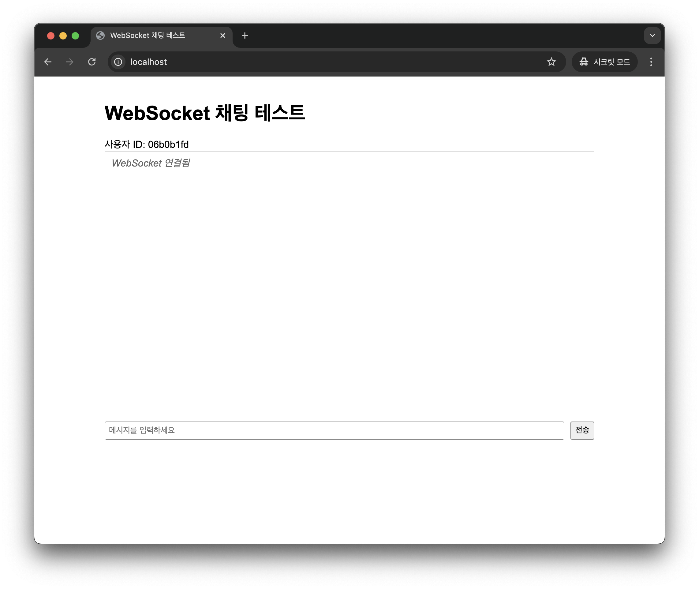

# Simple Multi-user Single-room Realtime Webchat App
A multi-user single-room real-time web chat application built with aiohttp and asyncio, featuring real-time communication through WebSocket.

## Prerequisites
- Python 3.11
- Poetry (if running with plain Python)
- Docker and Docker Compose

## How to Run

### Using Docker Compose
1. Clone repository
```shell
git clone https://github.com/seedspirit/lablup-toy-project.git
```

2. Change into project directory 
```shell
cd lablup-toy-project
```

3. Run docker-compose command
```shell
# Run in single thread mode
docker compose up --build

# Run in multi-process mode (set workers according to your CPU cores)
APP_MODE=multi-process APP_WORKERS=4 docker compose up --build
```

4. You can access app in `localhost` or `127.0.0.1` (using 80 port)
> Note: Since the application uses session id in cookies for user identification, you can test multi-user chat scenarios by opening Chrome's Incognito window for each additional user.





### Using plain python
1. Clone repository
```shell
git clone https://github.com/seedspirit/lablup-toy-project.git
```

2. Change into project server directory 
```shell
cd lablup-toy-project/backend
```

3. Download dependencies
```shell
poetry install
```

4. Run Redis with Docker
```shell
docker run -d --name redis -p 6379:6379 redis
```

5. Run application with python3 & poetry
```shell
# Run in single thread mode
poetry run python main.py
# or
poetry run python main.py --mode thread

# Run in multi-process mode (set workers according to your CPU cores)
poetry run python main.py -m multi-process -w 4
```

6. You can access app in `localhost` or `127.0.0.1` (using 80 port)
> Note: Since the application uses session id in cookies for user identification, you can test multi-user chat scenarios by opening Chrome's Incognito window for each additional user.


